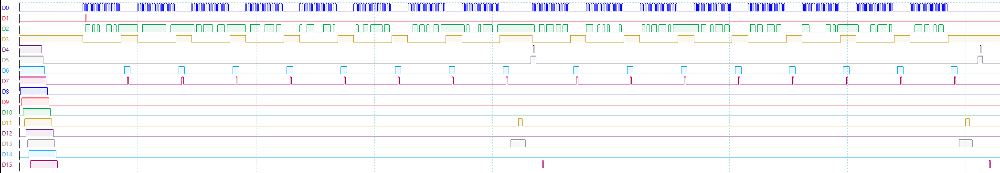

# MSPI0 to MSPI2 Data Transfer using DMA on RH850U2A/8  

## Project Overview  
This project demonstrates data transmission and reception using **MSPI0** and **MSPI2** on the **RH850U2A/8** microcontroller. The data transfer process is managed using **SDMAC00** and **SDMAC01** to optimize performance and reduce CPU load.  

- **MSPI0** transmits **2 frames**, each consisting of **8 transmissions of 16 bits**.  
- **MSPI2** receives these frames at **address 0xFE400D00**.  
- A logic analyzer was used to capture and analyze the communication signals.  

## Signal Capture  
Below is a signal capture illustrating the transmission and reception process:  

  

### Signal Descriptions  
The image above represents different signals observed during transmission and reception:

| Signal | Description |
|--------|------------|
| **D0**  | Clock signal (CLK) |
| **D1**  | Master In Slave Out (MISO) |
| **D2**  | Master Out Slave In (MOSI) |
| **D3**  | Chip Select (CS) |
| **D6**  | Interrupt Service Routine (ISR) for MSPI2 RX |
| **D7**  | Flag clear of the RX ISR |
| **D11** | T2 bit of **SDMAC01** |
| **D12** | ISR of **SDMAC01** |
| **D15** | End of MSPI2 frame reception |

## Hardware & Configuration  
- **Microcontroller**: RH850U2A/8  
- **Transmission Interface**: MSPI0  
- **Reception Interface**: MSPI2  
- **DMA Channels Used**:  
  - **SDMAC00** for MSPI0 Transmission  
  - **SDMAC01** for MSPI2 Reception  
- **Frame Format**:  
  - Each frame contains **8 transmissions of 16 bits**  
  - Data is sent and received in a structured manner for easy decoding  
